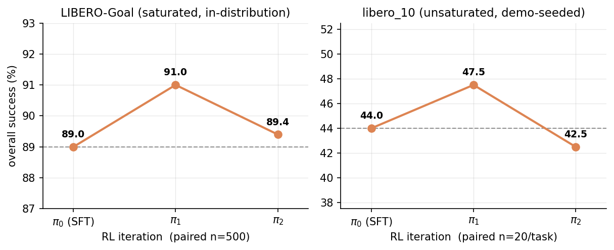

# VLATune: Reward-Weighted Behavior Cloning for Flow-Matching VLAs on LIBERO

Vision-language-action (VLA) models tend to plateau under supervised fine-tuning, and
reinforcement learning is the obvious next thing to try. The problem is that modern VLAs
generate actions with a flow-matching denoiser, which gives no tractable per-action
log-probability, so PPO does not apply directly.

This project asks whether a lighter, flow-matching-compatible RL step can do better:
filtered and reward-weighted behavior cloning on a policy's own successful rollouts, kept
close to the SFT policy by a vector-field trust-region anchor. The model is
[SmolVLA](https://huggingface.co/lerobot/smolvla_base) (450M), the benchmark is
[LIBERO](https://github.com/Lifelong-Robot-Learning/LIBERO), and the whole pipeline runs on
one consumer GPU plus preemptible Colab, for about $20-60 of compute.

The short answer is no, and the negative result is the contribution. On both a saturated
in-distribution suite (LIBERO-Goal) and an unsaturated, demo-seeded one (`libero_10`), success
rises for one RL iteration and then falls back to where it started. The apparent gain is a
reshuffling of success across tasks, inside measurement noise. What the project delivers is the
method itself, a paired collection-equals-evaluation protocol, and an account of where this kind
of RL can and cannot move a flow-matching policy.

Paper: [`paper/main.pdf`](paper/main.pdf) (LaTeX source in [`paper/`](paper)).

## Method

1. **SFT.** Fine-tune `smolvla_base` on the LIBERO-Goal episodes, and separately train a
   `libero_10` specialist. This is the launch point and the frozen anchor, `π_SFT`.
2. **RL loop.** For one outer iteration: roll out the current policy, keep the successful
   trajectories (weighted by a free time-to-success signal), and keep training on them with the
   flow-matching loss. A vector-field distillation penalty, `β·‖v_θ − v_SFT‖²`, holds the policy
   near `π_SFT` and stands in for an intractable marginal KL. Repeat, and stop early if a step
   regresses.
3. **Demo-seed.** A goal-only policy scores about 0% zero-shot on `libero_10`, so the success
   filter has nothing to keep. Training a `libero_10` specialist first lifts it off the floor, and
   only then does the loop have anything to work with.
4. **Collection equals evaluation.** The rollout success predicate is exactly LeRobot's
   `pc_success`, so each iteration's collection doubles as that policy's per-task evaluation,
   paired on identical seeds across `π_0`, `π_1`, and `π_2`.

The full method is in [`docs/METHOD.md`](docs/METHOD.md); the design rationale and a set of
anticipated questions are in [`docs/FAQ.md`](docs/FAQ.md).

## Results

Success rates are `pc_success` (%). RL trajectories are paired on identical seeds across iterations.

| Stage | Suite | n | Result |
|---|---|---|---|
| Official baseline (`HuggingFaceVLA/smolvla_libero`) | LIBERO-Goal | 100 | 85.0 |
| Goal SFT (ours, 16k/20k steps) | LIBERO-Goal | 100 | 89.0 (+4.0, within noise) |
| RL: filtered BC, β=10 | LIBERO-Goal | 500 (paired) | 89.0 → 91.0 → 89.4 |
| Zero-shot probe (goal-only policy) | `libero_10` | 10/task | ~0 (filter starves) |
| Demo-seed SFT | `libero_10` | 100 | 50.0 |
| RL: filtered BC, β=10 | `libero_10` | 20/task (paired) | 44.0 → 47.5 → 42.5 |



Two mechanisms sit behind the flat result (per-task detail in
[figure 2](results/figures/figure2_pertask.png)):

- **Rescue, then reversal.** The first iteration lifts marginal tasks that `π_0` already solved a
  few times (`libero_10` t3 goes 60 to 75, t7 goes 25 to 40). The second iteration hands those
  same tasks back (t3 to 55, t7 to 25).
- **Starvation floor.** A task with zero seed successes (`libero_10` t8) gives the filter nothing
  to imitate, so it stays at zero.

Every per-task number is in [`results/`](results); the figures regenerate from those files with
[`src/make_figures.py`](src/make_figures.py).

## Reproducing

Stack: `lerobot 0.5.1`, `torch 2.10.0+cu128`, `transformers 5.3.0`, `python 3.12.13`. SFT and
fine-tuning run on an A100 (GPU-bound); rollouts and evaluation run on an L4 (sim/CPU-bound, where
a bigger GPU just idles). Evaluation uses relative control, `n_action_steps=10`, the camera
`rename_map`, `MUJOCO_GL=egl`, and one process per task (a multi-task eval crashes at the task
transition on long-running EGL contexts).

Five fixes the SFT pipeline needed (detail in [`docs/SFT_RUNBOOK.md`](docs/SFT_RUNBOOK.md)):

1. Pass `--policy.push_to_hub=false`, or `lerobot-train` aborts asking for a `repo_id`.
2. `HuggingFaceVLA/libero` has a broken episode-to-file index. Download the full `data/` and
   `meta/` once (about 35 GB), then filter on the in-row `episode_index` column.
3. Rename the cameras (`image` to `camera1`, `image2` to `camera2`); the base model expects three.
4. Use the same `rename_map` at eval, since the checkpoint inherits the `camera1/2/3` keys.
5. Create `~/.libero/config.yaml` ahead of time so eval subprocesses don't hit `EOFError` on the
   import prompt.

SFT and baseline eval run from the Colab notebooks in [`notebooks/`](notebooks). The RL loop runs
from the `src/` scripts:

```bash
# 1. collect rollouts (this is also the paired per-task eval) for the current policy
python src/rl_rollout.py  --suite libero_goal --task-ids 0,1,2,3,4,5,6,7,8,9 \
    --n-per-task 50 --base-pm <π_k>/pretrained_model --out <rollouts_dir>
# 2. reward-weighted filtered-BC fine-tune with the vector-field anchor (β=10)
python src/rl_finetune.py --suite libero_goal --kept-dir <rollouts_dir> --beta 10 \
    --base-pm <π_SFT>/pretrained_model --task-ids 0,1,2,3,4,5,6,7,8,9 \
    --max-steps 1000 --batch-size 16 --lr 2e-5 --out <π_next>
# 3. optional: formal per-task lerobot-eval of a checkpoint
python src/rl_eval.py --suite libero_goal --ckpt-pm <ckpt>/pretrained_model \
    --task-ids 0,1,2,3,4,5,6,7,8,9 --n-episodes 50 --out-root <eval_dir>
```

Checkpoints and rollout tensors stay on Drive, since they are large. The trained-episode-index
lists (`dataset_goal_episodes.json`, `dataset_l10_episodes.json`) live there too and should be
committed next to the results once they are pulled back.

## Layout

```
paper/        main.tex + references.bib + figures/ + the built main.pdf
src/          rl_rollout.py, rl_finetune.py, rl_eval.py, make_figures.py
notebooks/    01_sft_train.ipynb, 02_eval.ipynb (Colab, markdown-narrated)
results/      the 6 result JSONs + figures/ + raw/ eval output
configs/      eval parameters
docs/         METHOD.md, SFT_RUNBOOK.md, SFT_DESIGN.md, FAQ.md, flags.md, versions.md, rename_map_notes.md
scripts/      environment setup + smoke tests
```

## On the negative result

The flat result is reported as one, not dressed up as a win. The +4.0 SFT gain over baseline sits
inside the n=100 confidence interval, so it is not a claim; the SFT stage delivers a working
pipeline and a clean starting point for RL, and that is what it is good for. A real claim would
need n=500 and at least three seeds (tens of hours on `libero_10`'s slow renderer), but the
up-then-down trajectory already reads as noise by the same standard. The limitations are listed in
the paper and in [`docs/FAQ.md`](docs/FAQ.md).
